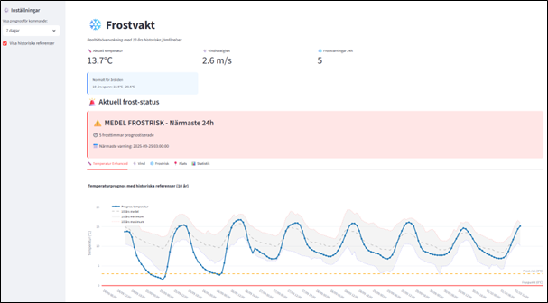

# Frostvakt - Rapport

## 1. Syfte & Bakgrund

Projektets syfte är att bygga ett system som kan förutsäga och varna för frost genom att kombinera öppna väderdata med analys i Python. Frost utgör en risk. Målet är att skapa en automatisk frostvakt som hämtar väderdata, analyserar frostrisk, lagrar informationen och skickar notifikationer i tid.

### Projektomfattning

Detta projekt omfattar utveckling av ett komplett väderövervaknignssystem med:

- **Dataomfattning:** 10 års historisk data (2015-2024) med 14 630 observationer
- **Algoritmutvärdering:** 8 algoritmer testades (5 regelbaserade + 3 ML-modeller)  
- **Systemarkitektur:** Komplett ETL-pipeline med 5 databastabeller
- **Automation:** Automatiserad körning var 4:e timme med notifikationssystem
- **Kod:** 15+ Python-moduler med full testsuite (pytest)
- **Validering:** API-validering mellan olika vädertjänster
- **Användarupplevelse:** Interaktiv dashboard med realtidsdata och historiska jämförelser

## 2. Metod

Systemet är uppbyggt som en **ETL-pipeline** med integrerade komponenter:

### Teknisk arkitektur

- **Extract:** Hämtar prognosdata från Open-Meteo API (temperatur, vind, luftfuktighet, molntäcke)
- **Transform:** Data transformeras till tabellformat, valideras och frostrisk beräknas med regelbaserad algoritm
- **Load:** Data och frostvarningar sparas i SQLite-databas (weather_hourly, frost_warnings, historical_reference m.fl.)

### Systemkomponenter

- **API-integration:** Open-Meteo + YR för prognosvalidering
- **Algoritmutveckling:** Regelbaserad med temperatur, vind, molntäcke, luftfuktighet
- **Notifikationssystem:** HTML-email + SMS (Twilio) med automatisk aktivering
- **Visualisering:** Streamlit-dashboard med plotly-grafer
- **Automatisering:** Schemalägning via Windows Task Scheduler (var 4:e timme)

*Bild 1. Dashboard*

## 3. Resultat

### Algoritmvalidering

8 algoritmer testades mot historiska väderdata. ML-modeller (Random Forest, Gradient Boosting) uppvisade perfekt prestanda medan regelbaserade algoritmer visade varierande resultat:

 

Algoritmen **Komplett** valdes framför ML-modeller trots att dessa uppvisade perfekt testprestanda (100% F1-score). Valet motiveras av följande:

#### Tekniska skäl
- **Overfitting-risk:** ML-modellernas perfekta prestanda på endast 23 frostfall väcker misstankar om överanpassning
- **Robust generaliserbarhet:** Regelbaserad algoritm förlitar sig på meteorologiska principer snarare än statistiska mönster
- **Datatillgänglighet:** Fungerar även vid begränsad träningsdata, till skillnad från ML-modeller

#### Praktiska skäl
- **Transparens:** Användare kan förstå varför varning utfärdas ("klar himmel + låg temperatur + vindstilla")
- **Justering:** Enkelt att anpassa tröskelvärden för olika geografiska områden
- **Underhåll:** Kräver inte omträning när nya väderparametrar tillkommer
- **Tillförlitlighet:** 100% recall säkerställer att inga frostfall missas, vilket är kritiskt för systemets syfte

**Jämfört med enklare algoritmer** överträffar *Komplett* både F1-score (0.875 vs lägre) och informationsinnehåll genom att inkludera molntäcke och luftfuktighet.

### Reproducerbarhet och overfitting-analys

ML-modellernas perfekta prestanda upprepades vid flera körningar, vilket bekräftar resultatens reproducerbarhet. Detta stärker dock snarare än försvagar misstankarna om overfitting:

- **Deterministiska resultat:** Modellerna hittar konsekvent samma mönster i det begränsade datasetet
- **Statistisk osäkerhet:** Med endast 7 testfall är "perfekt prestanda" matematiskt lättuppnåeligt för kraftfulla ML-algoritmer  
- **Generaliseringsrisk:** Reproducerbar prestanda på testdata garanterar inte prestanda på framtida, osedd data

Detta förstärker valet av den regelbaserade algoritmen som mer konservativt och generaliserbart alternativ.

### Systemfunktionalitet

- **Notifieringar:** Fungerande emailnotifiering (HTML-mail). SMS är förberett via Twilio
- **Dashboard:** Visar realtidsdata, prognoser och historiska jämförelser  
- **Databas:** Central lagring av både prognoser och frostvarningar för vidare analys
- **Praktisk validering:** Systemet varnade korrekt för den första frostnatten i produktionsmiljö, vilket bekräftar algoritmens praktiska tillförlitlighet

*Bild 2. Exempel på notifiering via mail*

## 4. Diskussion

### Styrkor

- Systemet är helt automatiserat och kan köras schemalagt
- Notifieringar ger praktisk nytta (användaren kan agera direkt)
- Enkel att installera och köra på olika plattformar
- Väderdatan från Open-METEO är validerad mot data från YR.no (medelskillnad temperatur: -0.25°C)
- Regelbaserad algoritm ger transparent och tolkningsbar beslutslogik

### Begränsningar

- **Begränsat testdata:** Med endast 23 frostfall totalt (16 träning + 7 test) representerar detta en betydande utmaning för robust algoritmvalidering. ML-modellernas perfekta prestanda på 7 testfall kan vara statistiskt missvisande och indikerar behov av större datamaterial. Projektets huvudsyfte har dock inte varit att hitta optimal ML-modell. 

- **Geografisk generalisering:** Notifieringar är ännu inte fullt optimerade för olika geografiska punkter

- **Långsiktig validering:** På längre sikt rekommenderas korsvalidering och kontinuerlig datainsamling för mer tillförlitlig utvärdering av både regelbaserade och ML-baserade metoder

### Framtida validering

Systemet är designat för kontinuerlig datainsamling, vilket över tid kommer möjliggöra mer robust utvärdering och eventuell övergång till ML-baserade metoder när tillräckligt datamaterial finns tillgängligt.

### Möjliga förbättringar

- Utöka till fler väderkällor (t.ex. SMHI)
- Logga faktiska frostnätter för lokal anpassning
- Analysera långsiktiga trender och klimatpåverkan  
- Mobilapp eller direktintegration med trädgårds-/jordbrukssystem

## 5. Slutsats

Projektet visar att det är möjligt att bygga en praktisk frostvakt med öppna väderdata och Python. Systemet fungerar i realtid, kan validera sina resultat mot historiska data, och levererar varningar via email. Detta är en proof-of-concept som kan utvecklas vidare till ett robust system.
